# Diagrama de Base de Datos

```mermaid
erDiagram
    %% Anime/Series/Hentai
    Anime {
        int id PK
        nvarchar title
        nvarchar image
        int episodes
        char status
        datetime createdAt
    }
    
    Hentai {
        int id PK
        nvarchar title
        nvarchar image
        int episodes
        char status
        datetime createdAt
    }
    
    Series {
        int id PK
        nvarchar imdbId
        nvarchar title
        nvarchar image
        int year
        decimal rating
        nvarchar type
        char status
        datetime createdAt
    }
    
    Genre {
        int id PK
        nvarchar name
    }
    
    HentaiGenre {
        int hentaiId FK
        int genreId FK
    }
    
    %% Galerías
    GirlGalery {
        int id PK
        nvarchar name
        datetime createdAt
    }
    
    AnimeGalery {
        int id PK
        nvarchar name
        datetime createdAt
    }
    
    Proyect {
        int id PK
        nvarchar name
        nvarchar description
        nvarchar url
        datetime createdAt
    }
    
    Media {
        int id PK
        char type
        int refId
        nvarchar url
        nvarchar thumbnail
        nvarchar deleteUrl
        int orderIndex
        datetime createdAt
    }
    
    %% JAV
    Actress {
        int id PK
        nvarchar name
        nvarchar image
        datetime createdAt
    }
    
    Jav {
        int id PK
        nvarchar code
        int actressId FK
        nvarchar image
        char status
        datetime createdAt
    }
    
    %% Tags y Links
    Tag {
        int id PK
        nvarchar name
        char type
    }
    
    TagRelation {
        int tagId FK
        int refId
        char type
    }
    
    Link {
        int id PK
        char type
        int refId
        nvarchar name
        nvarchar url
        int orderIndex
        datetime createdAt
    }
    
    %% YouTube
    YouTube {
        int id PK
        nvarchar url
        nvarchar title
        nvarchar authorName
        nvarchar thumbnailUrl
        nvarchar html
        char category
        datetime createdAt
    }
    
    %% Dota 2
    DotaHero {
        int id PK
        nvarchar name
        nvarchar image
        datetime createdAt
    }
    
    DotaTreasure {
        int id PK
        nvarchar name
        nvarchar image
        nvarchar imagePresentation
        int year
        char type
        datetime createdAt
    }
    
    DotaCache {
        int id PK
        int treasureId FK
        int heroId FK
        nvarchar name
        nvarchar photo
        decimal price
        int quantity
        decimal total
        nvarchar owner
        datetime createdAt
    }
    
    DotaMedia {
        int id PK
        char type
        int refId
        nvarchar url
        int orderIndex
        datetime createdAt
    }
    
    %% Steam
    SteamItem {
        int id PK
        nvarchar name
        nvarchar image
        nvarchar price
        char game
        nvarchar marketUrl
        char status
        datetime createdAt
    }
    
    SteamItemDrop {
        int id PK
        int steamItemId FK
        int quantity
        decimal price
        decimal salePrice
        decimal total
        datetime createdAt
    }
    
    SteamItemPurchase {
        int id PK
        int steamItemId FK
        decimal purchasePrice
        decimal salePrice
        decimal profit
        char status
        datetime purchaseDate
        datetime saleDate
        datetime createdAt
    }
    
    %% Cuentas
    Account {
        int id PK
        char type
        nvarchar name
        nvarchar username
        nvarchar password
        nvarchar profileUrl
        nvarchar phoneNumber
        nvarchar recoveryEmail
        datetime lastConnection
        datetime createdAt
    }
    
    AccountRelation {
        int id PK
        int parentAccountId FK
        int childAccountId FK
        datetime createdAt
    }
    
    AccountProperty {
        int id PK
        int accountId FK
        char key
        bit value
        datetime createdAt
    }
    
    %% Dinero
    Person {
        int id PK
        nvarchar name
        datetime createdAt
    }
    
    Payment {
        int id PK
        int personId FK
        char type
        decimal amount
        nvarchar description
        date date
        datetime createdAt
    }
    
    Salary {
        int id PK
        decimal currentMoney
        decimal grossSalary
        decimal afpDiscount
        decimal firstFortnightNet
        decimal secondFortnightNet
        decimal cts
        decimal bonus
        datetime createdAt
    }
    
    %% Posts
    Post {
        int id PK
        nvarchar title
        nvarchar description
        char category
        nvarchar subcategory
        nvarchar slug
        date date
        datetime createdAt
    }
    
    PostContent {
        int id PK
        int postId FK
        char type
        nvarchar text
        nvarchar language
        nvarchar url
        nvarchar alt
        int orderIndex
        datetime createdAt
    }
    
    PostContentItem {
        int id PK
        int postContentId FK
        nvarchar text
        int orderIndex
    }
    
    %% Tareas
    TaskList {
        nvarchar id PK
        nvarchar title
        char status
        datetime createdAt
        datetime updatedAt
    }
    
    Task {
        nvarchar id PK
        nvarchar taskListId FK
        nvarchar title
        bit completed
    }
    
    %% Eventos
    Event {
        nvarchar id PK
        nvarchar title
        date startDate
        date endDate
        char type
        bit allDay
        nvarchar color
        datetime createdAt
    }
    
    %% Vendedor
    Seller {
        int id PK
        nvarchar name
        nvarchar whatsapp
        nvarchar products
        datetime createdAt
    }
    
    %% Relaciones
    Hentai ||--o{ HentaiGenre : "tiene"
    Genre ||--o{ HentaiGenre : "pertenece"
    
    Actress ||--o{ Jav : "actúa en"
    
    GirlGalery ||--o{ Media : "tiene fotos"
    AnimeGalery ||--o{ Media : "tiene fotos"
    Proyect ||--o{ Media : "tiene fotos"
    
    DotaTreasure ||--o{ DotaCache : "contiene"
    DotaHero ||--o{ DotaCache : "para héroe"
    DotaTreasure ||--o{ DotaMedia : "tiene fotos"
    DotaCache ||--o{ DotaMedia : "tiene fotos"
    
    SteamItem ||--o{ SteamItemDrop : "drops"
    SteamItem ||--o{ SteamItemPurchase : "compras"
    
    Account ||--o{ AccountRelation : "padre"
    Account ||--o{ AccountRelation : "hijo"
    Account ||--o{ AccountProperty : "propiedades"
    
    Person ||--o{ Payment : "pagos/deudas"
    
    Post ||--o{ PostContent : "contenido"
    PostContent ||--o{ PostContentItem : "items"
    
    TaskList ||--o{ Task : "tareas"
    
    Tag ||--o{ TagRelation : "tiene"
    Jav ||--o{ TagRelation : "etiquetas"
    Proyect ||--o{ TagRelation : "etiquetas"
    Post ||--o{ TagRelation : "etiquetas"
    
    Jav ||--o{ Link : "links streaming"
    Proyect ||--o{ Link : "links extra"
    GirlGalery ||--o{ Link : "links"
    Actress ||--o{ Link : "links"
    Post ||--o{ Link : "links"
```

## Leyenda de Tipos (CHAR)

### Status General
- `1` = Próximamente / En proceso / Comprado / Historial
- `2` = Completado / Vendido / Por comprar

### Media Type
- `1` = GirlGalery
- `2` = AnimeGalery
- `3` = Project

### Link Type
- `1` = Project (url_extra)
- `2` = Jav (streaming)
- `3` = Helper
- `4` = GirlGalery
- `5` = Actress
- `6` = Post

### Tag Type
- `1` = Jav
- `2` = Project
- `3` = Post
- `4` = Otros

### YouTube Category
- `1` = Anime
- `2` = Serie
- `3` = Película
- `4` = Shorts

### Account Type
- `1` = Email
- `2` = Steam
- `3` = Facebook
- `4` = Instagram
- `5` = Game
- `6` = Other

### Account Property Key
- `1` = hasDota2
- `2` = hasCS2
- `3` = hasSteamMobile
- `4` = vacBanned

### Payment Type
- `1` = Deuda
- `2` = Pago
- `3` = Interés deuda
- `4` = Interés pago

### Post Category
- `1` = Frontend
- `2` = Backend
- `3` = Mobile
- `4` = Diseño
- `5` = Base de Datos
- `6` = Utilidades
- `7` = ORM
- `8` = Fullstack

### PostContent Type
- `1` = Título
- `2` = Párrafo
- `3` = Código
- `4` = Imagen
- `5` = Lista

### DotaTreasure Type
- `1` = Treasure I
- `2` = Treasure II
- `NULL` = Sin número

### DotaMedia Type
- `1` = DotaTreasure
- `2` = DotaCache

### SteamItem Game
- `1` = Dota 2
- `2` = CS2

### Event Type
- `1` = Festivo
- `2` = Personal

### TaskList Status
- `1` = En proceso
- `2` = Completado
